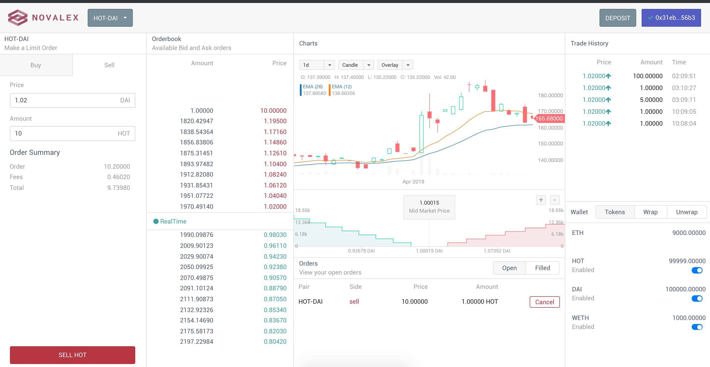
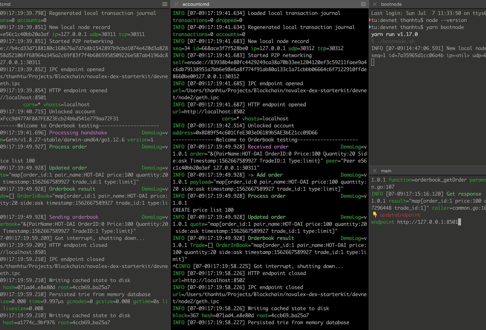

---

[Nova Protocol](https://novaprotocol.io) is an open source framework for building decentralized exchanges.

More detailed information can be found in our [developer documentation](https://developer.novaprotocol.io/overview/getting-started.html).

Building on Nova? Come chat with our team on our [Nova Relayer Slack Channel](https://join.slack.com/t/novarelayer/shared_invite/enQtNTc1Mjc3MDUyNTkzLWNmZjI0YmFhNTg4OTU4NTI5ZWE1MzY1ZTc1MDMyYmE1YzkwYWUwYzQ2MTNhMTRjNmVjMmEyOTRkMjFlNzAyMTQ).

---

# Standard DEX Scaffold

This repository provides a basic template for building a Decentralized Exchange (DEX) on the Ethereum blockchain. When you finish the steps outlined in this guide, you will have:

- Setup a fully functioning DEX (or "Nova Relayer") on your local server
- Leveraged Nova Protocol smart contracts on Ethereum to securely exchange tokens
- Performed some trades on your DEX
- Learned how to customize your DEX: change fees, add markets, etc.



It should take less than 10 minutes to get your DEX running.

# Devnet Blockchain

Go to [DEVNET](devnet/README.md) for more detail



# Development

`yarn start`

# Document

If you want to see more detail, you can start serving docs:

`yarn docs --port 5000`

# Setup environment with testing

```bash
# create schema
docker-compose exec db psql -U postgres -d postgres -c "DROP SCHEMA public CASCADE"
docker-compose exec db psql -U postgres -d postgres -c "CREATE SCHEMA public"
docker-compose exec db psql -U postgres -d postgres -c "GRANT ALL ON SCHEMA public TO postgres"
docker-compose exec db psql -U postgres -d postgres -c "GRANT ALL ON SCHEMA public TO public"

docker-compose exec db bash -c 'psql -U postgres -d postgres < /docker-entrypoint-initdb.d/0001-init.up.sql'

# seed data
docker-compose exec db bash -c 'psql -U postgres -d postgres < /docker-entrypoint-initdb.d/0002-seed.sql'

# run query
docker-compose exec db psql -U postgres -d postgres -c 'SELECT * FROM markets'

# run a more complex query
docker-compose exec db psql -U postgres -d postgres -c "select sum(amount) as locked_balance from orders where status='pending' and trader_address='0xe36ea790bc9d7ab70c55260c66d52b1eca985f84' and market_id like 'DAI-%' and side = 'sell'"

# can also update once using init sql file
docker-compose exec db psql -U postgres -d postgres -c "update markets set base_token_address='0x6F7ccbaCf134d826500ebCC574278cfC8aC5998d', quote_token_address='0x48690560139fCc885AD2B291f196c1908bc54281' where id='HOT-WETH'"

docker-compose exec db psql -U postgres -d postgres -c "SELECT * FROM markets where id='HOT-WETH'"

docker-compose exec db psql -U postgres -d postgres -c "update markets set base_token_address='0x6F7ccbaCf134d826500ebCC574278cfC8aC5998d', quote_token_address='0x31D7A88aF82D915eA4E74bbe1D95099546f596Cc' where id='HOT-DAI'"

docker-compose exec db psql -U postgres -d postgres -c "SELECT * FROM markets where id='HOT-DAI'"

docker-compose exec db psql -U postgres -d postgres -c "update markets set base_token_address='0x48690560139fCc885AD2B291f196c1908bc54281', quote_token_address='0x31D7A88aF82D915eA4E74bbe1D95099546f596Cc' where id='WETH-DAI'"

docker-compose exec db psql -U postgres -d postgres -c "SELECT * FROM markets where id='WETH-DAI'"

docker-compose exec db psql -U postgres -d postgres -c "update tokens set address='0x6F7ccbaCf134d826500ebCC574278cfC8aC5998d' where symbol='HOT'"

docker-compose exec db psql -U postgres -d postgres -c "update tokens set address='0x31D7A88aF82D915eA4E74bbe1D95099546f596Cc' where symbol='DAI'"

docker-compose exec db psql -U postgres -d postgres -c "update tokens set address='0x48690560139fCc885AD2B291f196c1908bc54281' where symbol='WETH'"
```
